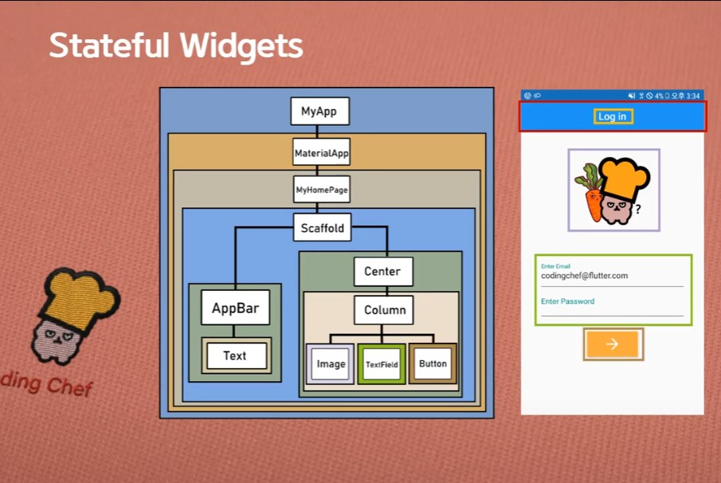

> 유튜브 [코딩셰프] 플러터(flutter) 강좌 순한맛 5~8


완전 초보용 플러터 강좌 5

# Widget

> 플러터의 모든것은 위젯이다

## Types of Widgets

1. Stateless Widget

   > 스크린상에 존재만 할 뿐 아무것도 하지 않음
   >
   > 어떠한 실시간 데이터도 저장하지 않음
   >
   > 어떤 변화(모양, 상태)를 유발시키는 value값을 가지지 않음

   - 이전 상호작용의 어떠한 값도 저장하지 않음
   - 상태가 없는 정적인 위젯

2. Stateful Widget

   > 사용자의 interaction에 따라서 모양이 바뀜
   >
   > 데이터를 받게 되었을 때 모양이 바뀜

   - Value 값을 지속적으로 추적 보존
   - 계속 움직임이나 변화가 있는 위젯

3. Inherited Widget


## Flutter Widget tree



1. Widget들은 tree 구조로 정리될 수 있음 (계층구조)
2. 한 Widget내에 얼마든지 다른 widget들이 포함될 수 있음
3. Widget은 부모 위젯과 자식 위젯으로 구성
4. Parent widget을 widget container라고 부르기도 함


완전 초보용 플러터 강좌 6~8

# Flutter 앱 만들기

목표

- Flutter 프로젝트 폴더의 구성
- 코드의 기본 내용 이해하기 / 앱페이지 기본 구성 공식화 해보기
- 첫 번째 flutter 앱 실행


## Flutter 프로젝트 폴더의 구성

1. pubspec.yaml
   - 프로젝트의 메타데이터를 정의하고 관리
     - 프로젝트의 버전
     - 프로젝트의 사용환경
     - dart의 버전 등등

2. android / ios폴더
   - 각 플랫폼에 맞게 앱을 배포하기 위한 정보

3. lib
   - main.dart 파일
   - 가장 많이 사용함


## main.dart

```dart
import 'package:flutter/material.dart';

void main() => runApp(ChefApp());

class ChefApp extends StatelessWidget {
  const ChefApp({Key? key}) : super(key: key);

  @override
  Widget build(BuildContext context) {
    return MaterialApp(
      title: 'First app',
      theme: ThemeData(
        primarySwatch: Colors.blue
      //primarySwatch로 견본색깔을 지정한다
      ),
      home: MyHomePage(),
      //home은 앱 실행시 화면에 가장 먼저 보여짐
      //MyHomePage()는 커스텀 위젯이다
    );
  }
}
```

- `=>` - fat arrow
  - 함수를 호출하는 기호

- `runApp(arg)` - argument를 반드시 필요로 하는 플러터의 최상위 함수
  - argument인 ChefApp() 위젯은 Screen layout을 최초로 빌드한다
- `ChefApp()` 위젯 - 커스텀 위젯 클래스, 앱의 layout을 빌드하는 역할만 함 (stateless)
  - 모든 커스텀 위젯은 다른 위젯을 리턴하는 build라는 함수를 가지고 있다


```dart
//MaterialApp의 home (자식위젯)에 리턴하는 커스텀 클래스
class MyHomePage extends StatelessWidget {
  const MyHomePage({Key? key}) : super(key: key);

  @override
  Widget build(BuildContext context) {
    return Scaffold(
      appBar: AppBar(
        title: Text('AppBar Title'),
      ),
      body: Center(
        child: Column(
          children: [
            Text('Hello'),
          // 위젯 사이에는 반드시 콤마가 존재해야 함
            Text('Hello'),
            Text('Hello')
          ],
        ),
      ),
    );
  }
}

```

- `Scaffold()`  - 앱 화면에 다양한 위젯을 배치하는 비어있는 도화지의 역할
  - `appBar: AppBar()` - 앱의 상단 바 클래스 (디폴트 파란색)
    - `title:` - 상단 바의 title
  - `body:` - 앱의 몸 부분
    - `Center(child:)` - 가운데로 정렬시켜주는 클래스
      - `Column(children)` - 위젯들을 세로로 나열해주는 클래스


# 클래스 명과 함수 명

함수 : 알파벳 소문자 시작

- main(), runApp()

클래스 : 알파벳 대문자 시작

- MyApp()