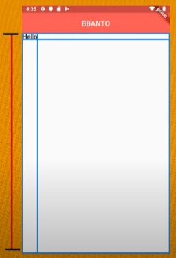

> 유튜브 [코딩셰프] 플러터(flutter) 강좌 순한맛 9~


완전 초보용 플러터 강좌 9

# 캐릭터 페이지 디자인 1

> 위젯정리


## AppBar

```dart
return Scaffold(
    appBar: AppBar(
        backgroundColor: Colors.orange,
        title: Text('BBANTO ID CARD'),
        centerTitle: true,
        elevation: 0.0,
    ),
```

Scaffold - appBar의 title은 centerTitle로 center로 위치시킬 수 있다

AppBar 아래의 그림자는 elevation으로 조절 할 수 있다


## Body

Padding 위젯으로 padding 설정가능



> Row는 가로의 제한이 없는 대신 세로의 제한이 있고,
>
> Column은 세로의 제한이 없는 대신 가로의 제한이 있다

**Row**

- Center 위젯으로 Row를 감싸면 가운데로 **수직**이동한다
- Row의  children을 Center 위젯으로 감싸면 가운데로 **수직**이동한다

**Column**

- Center 위젯으로 Column을 감싸면 가운데로 **수평**이동한다
- Column의  children을 Center 위젯으로 감싸면 가운데로 **수평**이동한다


CircleAvatar - 이미지 파일을 동그랗게 잘라 줌

Divider - 수평선 생성


# 실습

```dart
import 'package:flutter/material.dart';

void main() => runApp(ChefApp());

class ChefApp extends StatelessWidget {
  const ChefApp({Key? key}) : super(key: key);

  @override
  Widget build(BuildContext context) {
    return MaterialApp(
      debugShowCheckedModeBanner: false,
      title: 'BBANTO',
      theme: ThemeData(
          primarySwatch: Colors.blue
        //primarySwatch로 견본색깔을 지정한다
      ),
      home: BBANTOCard(),
      //home은 앱 실행시 화면에 가장 먼저 보여짐
      //MyHomePage()는 커스텀 위젯
    );
  }
}

class BBANTOCard extends StatelessWidget {
  const BBANTOCard({Key? key}) : super(key: key);

  @override
  Widget build(BuildContext context) {
    return Scaffold(
      backgroundColor: Colors.amber[700],
      appBar: AppBar(
        backgroundColor: Colors.amber[800],
        title: Text('BBANTO ID CARD'),
        centerTitle: true,
        elevation: 0.0,
      ),
      body: Padding(
        padding: const EdgeInsets.fromLTRB(30.0, 40.0, 0.0, 0.0),
        child: Column(
          crossAxisAlignment: CrossAxisAlignment.start,
          children: [
            Center(
              child: CircleAvatar(
                backgroundImage: AssetImage('android_winner.png'),
                backgroundColor: Colors.black,
                radius: 60.0,
              ),
            ),
            Divider(
              height: 60.0, //Divider의 두께가 아닌 위아래 간격 (30픽셀씩)
              color: Colors.grey[850],
              thickness: 0.5,
              endIndent: 30.0,
            ),
            Text('NAME',
            style: TextStyle(
              color: Colors.white,
              letterSpacing: 2.0,
            ),
            ),
            SizedBox(height: 10.0,),
            Text('BBANTO',
            style: TextStyle(
              color: Colors.white,
              letterSpacing: 2.0,
              fontSize: 28.0,
              fontWeight: FontWeight.bold,
            ),
            ),
            SizedBox(height: 30.0,),
            Text('BBANTO POWER LEVEL',
              style: TextStyle(
                color: Colors.white,
                letterSpacing: 2.0,
              ),
            ),
            SizedBox(height: 10.0,),
            Text('14',
              style: TextStyle(
                color: Colors.white,
                letterSpacing: 2.0,
                fontSize: 28.0,
                fontWeight: FontWeight.bold,
              ),
            ),
            SizedBox(height: 30.0,),
            Row(
              children: [
                Icon(Icons.check_circle_outline),
                SizedBox(width: 10.0,),
                Text('using lightsaber',
                style: TextStyle(
                  fontSize: 16.0,
                  letterSpacing: 1.0,
                ),
                )
              ],
            ),
            Row(
              children: [
                Icon(Icons.check_circle_outline),
                SizedBox(width: 10.0,),
                Text('hero face tattoo',
                  style: TextStyle(
                    fontSize: 16.0,
                    letterSpacing: 1.0,
                  ),
                )
              ],
            ),
            Row(
              children: [
                Icon(Icons.check_circle_outline),
                SizedBox(width: 10.0,),
                Text('fire flames',
                  style: TextStyle(
                    fontSize: 16.0,
                    letterSpacing: 1.0,
                  ),
                )
              ],
            ),
            Center(
              child: CircleAvatar(
                backgroundImage: AssetImage('android3D.png'),
                radius: 50.0,
                backgroundColor: Colors.amber[700],
              ),
            )
          ],
        ),
      )
    );
  }
}
```

