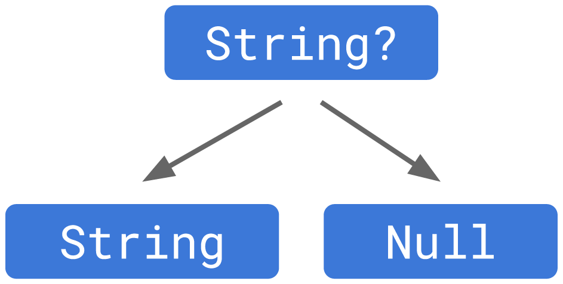

> <Youtube> [코딩셰프] 플러터(flutter) 강좌 순한맛 9~13	(2019.12.10~2019.12.31)
>
> <Youtube> [코딩셰프] 플러터 뉴스(Flutter news) 1~2		(2021.03.30~2021.04.11)


완전 초보용 플러터 강좌 9~11

# 캐릭터 페이지 디자인

> 위젯정리


## AppBar

```dart
return Scaffold(
    appBar: AppBar(
        backgroundColor: Colors.orange,
        title: Text('BBANTO ID CARD'),
        centerTitle: true,
        elevation: 0.0,
    ),
```

Scaffold - appBar의 title은 centerTitle로 center로 위치시킬 수 있다

AppBar 아래의 그림자는 elevation으로 조절 할 수 있다


## Body

Padding 위젯으로 padding 설정가능


> Row는 가로의 제한이 없는 대신 세로의 제한이 있고,
>
> Column은 세로의 제한이 없는 대신 가로의 제한이 있다

**Row**

- Center 위젯으로 Row를 감싸면 가운데로 **수직**이동한다
- Row의  children을 Center 위젯으로 감싸면 가운데로 **수직**이동한다

**Column**

- Center 위젯으로 Column을 감싸면 가운데로 **수평**이동한다
- Column의  children을 Center 위젯으로 감싸면 가운데로 **수평**이동한다


CircleAvatar - 이미지 파일을 동그랗게 잘라 줌

Divider - 수평선 생성


## 실습

```dart
import 'package:flutter/material.dart';

void main() => runApp(ChefApp());

class ChefApp extends StatelessWidget {
  const ChefApp({Key? key}) : super(key: key);

  @override
  Widget build(BuildContext context) {
    return MaterialApp(
      debugShowCheckedModeBanner: false,
      title: 'BBANTO',
      theme: ThemeData(
          primarySwatch: Colors.blue
        //primarySwatch로 견본색깔을 지정한다
      ),
      home: BBANTOCard(),
      //home은 앱 실행시 화면에 가장 먼저 보여짐
      //MyHomePage()는 커스텀 위젯
    );
  }
}

class BBANTOCard extends StatelessWidget {
  const BBANTOCard({Key? key}) : super(key: key);

  @override
  Widget build(BuildContext context) {
    return Scaffold(
      backgroundColor: Colors.amber[700],
      appBar: AppBar(
        backgroundColor: Colors.amber[800],
        title: Text('BBANTO ID CARD'),
        centerTitle: true,
        elevation: 0.0,
      ),
      body: Padding(
        padding: const EdgeInsets.fromLTRB(30.0, 40.0, 0.0, 0.0),
        child: Column(
          crossAxisAlignment: CrossAxisAlignment.start,
          children: [
            Center(
              child: CircleAvatar(
                backgroundImage: AssetImage('android_winner.png'),
                backgroundColor: Colors.black,
                radius: 60.0,
              ),
            ),
            Divider(
              height: 60.0, //Divider의 두께가 아닌 위아래 간격 (30픽셀씩)
              color: Colors.grey[850],
              thickness: 0.5,
              endIndent: 30.0,
            ),
            Text('NAME',
            style: TextStyle(
              color: Colors.white,
              letterSpacing: 2.0,
            ),
            ),
            SizedBox(height: 10.0,),
            Text('BBANTO',
            style: TextStyle(
              color: Colors.white,
              letterSpacing: 2.0,
              fontSize: 28.0,
              fontWeight: FontWeight.bold,
            ),
            ),
            SizedBox(height: 30.0,),
            Text('BBANTO POWER LEVEL',
              style: TextStyle(
                color: Colors.white,
                letterSpacing: 2.0,
              ),
            ),
            SizedBox(height: 10.0,),
            Text('14',
              style: TextStyle(
                color: Colors.white,
                letterSpacing: 2.0,
                fontSize: 28.0,
                fontWeight: FontWeight.bold,
              ),
            ),
            SizedBox(height: 30.0,),
            Row(
              children: [
                Icon(Icons.check_circle_outline),
                SizedBox(width: 10.0,),
                Text('using lightsaber',
                style: TextStyle(
                  fontSize: 16.0,
                  letterSpacing: 1.0,
                ),
                )
              ],
            ),
            Row(
              children: [
                Icon(Icons.check_circle_outline),
                SizedBox(width: 10.0,),
                Text('hero face tattoo',
                  style: TextStyle(
                    fontSize: 16.0,
                    letterSpacing: 1.0,
                  ),
                )
              ],
            ),
            Row(
              children: [
                Icon(Icons.check_circle_outline),
                SizedBox(width: 10.0,),
                Text('fire flames',
                  style: TextStyle(
                    fontSize: 16.0,
                    letterSpacing: 1.0,
                  ),
                )
              ],
            ),
            Center(
              child: CircleAvatar(
                backgroundImage: AssetImage('android3D.png'),
                radius: 50.0,
                backgroundColor: Colors.amber[700],
              ),
            )
          ],
        ),
      )
    );
  }
}
```


완전 초보용 플러터 강좌 12~13

# 다트(dart) 언어 핵심정리

> DartPad상에서 연습 - https://dartpad.dev/
>
> java와 달리 class의 필드(멤버변수)를 `.`으로 바로 호출 할 수 있다. (get/set 메소드 없이)
>
> java와 달리 타입 추론기능이 있어, 타입을 작성하지 않아도 된다.
>
> **but** - 타입을 작성하지 않으면, 틀린 타입이 대입되어도 complie 에러가 뜨지 않는다.


## 클래스와 위젯

> Class and Widget
>
> **Widget은 Class의 Instance이다!**


## Class

- 클래스 - Class
  - 객체가 가져야 하는 속성과 기능을 정의한 내용을 담고 있는 설계도 역할
- 객체 - Object
  - 클래스가 정의된 후 메모리상에 할당되었을 때 이를 객체라고 함
- 인스턴스 - Instance
  - 클래스를 기반으로 생성되는 것
  - 클래스의 속성과 기능을 똑같이 가지고 있고 프로그래밍 상에서 사용되는 대상


## 생성자

> Initailizer

```dart
class Person{
  late String name;
  late int age;
  late String sex;
  
  Person(String name, int age){
    this.name = name;
    this.age = age;
//     this.sex = sex;
  }
}

void main(){
  Person p1 = new Person('im', 20);
  print(p1.name);
  print(p1.age);
//   print(p1.sex);		//멤버변수 sex에 null이 할당 될 수 없으므로 error발생
}
```

> Person 클래스의 멤버변수들은 `late`변수로 호출시에 초기화가 되지만,
> 일반적인 Object이기에 null은 할당 될 수 없다.


### Named parameter

> 클래스 생성자의 매개변수(parameter)를 유동적으로 만들어서
> 생성자를 여러번 선언하지 않더라도
> 인스턴스로 호출 시, 인수(argument) 할당을 다양하게 할 수 있다.

```dart
class Person{
  String? name;
  int? age;
  String? sex;
  
  Person({required String? name,required int? age, String? sex}){
    this.name = name;
    this.age = age;
    this.sex = sex;
  }
}

void main(){
  Person p1 = new Person(name : 'im', age : 20);
  print(p1.name);
  print(p1.age);
  print(p1.sex);	// <= null
}
```

> 생성자의 argement에 중괄호 `{}`를 추가하면 입력이 Option이 된다.
> `required`를 추가하면 Option이 아닌 필수값이 된다.

```dart
Person p1 = new Person(name : null, age : null);
//required 표기된 parameter는 필수로 입력 해 줘야하지만, null도 가능하다.
```


------

Named parameter의 호출에서
` Person p1 = new Person(name : 'im', age : 20);`
argument를 보면 `name : 'im'`, `age : 20` 과 같은 형식이

Flutter의 Scaffold의 `appBar: AppBar()` argument 형식과 일치한다.

**모든 위젯은 클래스의 인스턴스**였던 것이다

<hr>


## 함수

> (java의 메소드와 비슷) 타입 추론기능이 있음, 

```dart
int addNumber(int num1, int num2){
  return num1+num2;
}

void main(){
  print(addNumber(2, 3));
}
///////////////////////////////////////
addNumber(num1, num2){
  return num1+num2;
}

void main(){
  print(addNumber(2, 3));
}
```

> 두 함수 모두 정상 작동하긴 함


플러터 뉴스(Flutter news) 1~2

# Null safety

> 강의와는 다르게 플러터 2.0 업데이트로, 변수의 초기화 관련이슈가 생김
>
> **null**은 필요하지만 개발자의 실수로 에러를 자주 야기시키기도 함

- non-nullable 변수에는 null 값을 할당 할 수 없고, 
  그렇기에 non-nullable 변수를 위한 null check가 필요없음

- **Class의 멤버변수**는 반드시 인스턴스 호출과 동시에 **초기화**를 시켜야 함


## 일반적 객체구조


## Null safety의 객체구조


## ?

> **null값을 할당하는 방법**
>
> Null safety에서의 Object의 형식
>
> > `Object` - not nullable type
> >
> > `Object?` - nullable type
>
> !과 함께 사용가능




- ! - Not nullable type (null이 아니라는 확인)

```dart
void main(){
  int x;
  x = 50;
  int? y;

  if (x > 0){
    y = x;
    }
  int value = y!;
  print(value);
}
```

> nullable type을 not-nullable type에 할당할 때 사용


## late

> late initailized
>
> **호출 시**에 초기화를 진행한다

```dart
class Person{
  late String name;
  late int age;
}

void main(){
  Person p1 = new Person();
  p1.age = 30;
  print(p1.age);
}
```


## required

> 해당 parameter의 argument가 필수이다
> (값이 할당되어야 한다는 표시)


