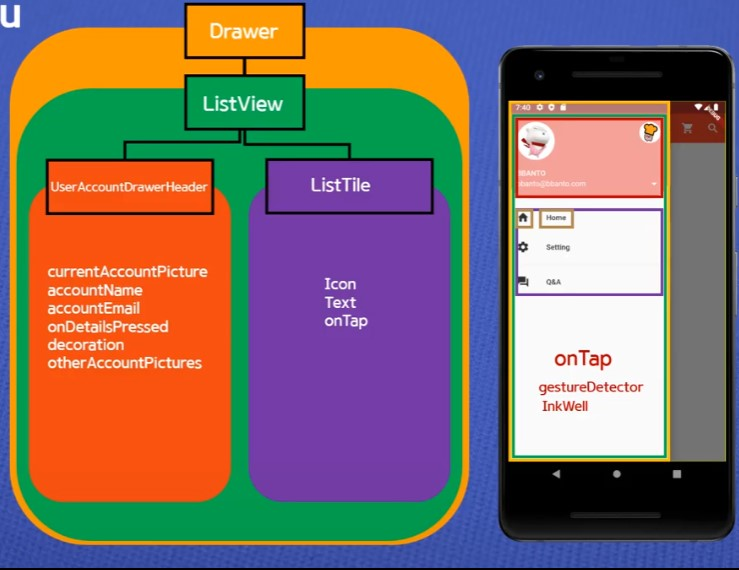
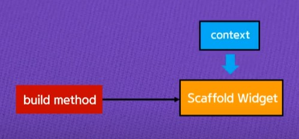
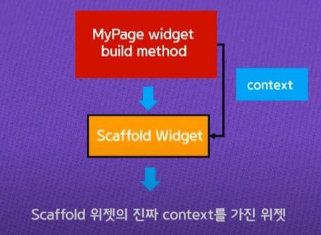
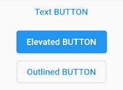
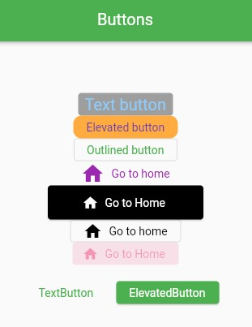

> <Youtube> [코딩셰프] 플러터(flutter) 강좌 순한맛 14~18	(2020.01.07~2020.01.28)
>
> <Youtube> [코딩셰프] 플러터(flutter) 26~27 - **패치 강좌 1~2**	(2021.06.02~2021.06.10)


*완전 초보용 플러터 강좌 14*

# 앱바(app bar) 메뉴 아이콘 추가하기


## appbar

> 주로 아이콘 버튼을 배치하는 argument들

- `leading : ` - 아이콘 버튼이나 간단한 위젯을 왼쪽에 배치할 때

- `actions : [] ` - 복수의 아이콘 버튼 등을 오른쪽에 배치할 때


## IconButton

> 아이콘 버튼 위젯에는 `icon:`과 `onPressed:`가 필수로 필요하다

- `onPressed:` - **함수의 형태**로 버튼을 터치했을 때 일어나는 이벤트를 정의하는 곳


```dart
    return Scaffold(
      appBar: AppBar(
        title: Text('Appbar icon menu'),
        centerTitle: true,
        elevation: 0.0,
        leading: IconButton(
          icon: Icon(Icons.menu),
          onPressed: (){
            print('menu button is clicked');
          },
        ),
        actions: [
          IconButton(
              onPressed: (){
                print('shopping button is clicked');
              },
              icon: Icon(Icons.shopping_cart)),
          IconButton(
              onPressed: (){
                print('search is clicked');
              },
              icon: Icon(Icons.search))
        ],
      ),
    );
```


*완전 초보용 플러터 강좌 15~16*

# Drawer 메뉴 만들기

> onPressed와 onTap - onPressed는 주로 button에 쓰이고 onTap의 기능이 더 많다
>
> onTap은 splash 효과가 디폴트

```dart
import 'package:flutter/material.dart';

void main(){
  runApp(MyApp());
}

class MyApp extends StatelessWidget {
  const MyApp({Key? key}) : super(key: key);

  @override
  Widget build(BuildContext context) {
    return MaterialApp(
      debugShowCheckedModeBanner: false,
      title: 'Appbar',
      theme: ThemeData(
        primarySwatch: Colors.red,
      ),
      home: MyPage(),
    );
  }
}

class MyPage extends StatelessWidget {
  const MyPage({Key? key}) : super(key: key);

  @override
  Widget build(BuildContext context) {
    return Scaffold(
      appBar: AppBar(
        title: Text('Appbar icon menu'),
        centerTitle: true,
        elevation: 0.0,
        actions: [
          IconButton(
              onPressed: (){
                print('shopping button is clicked');
              },
              icon: Icon(Icons.shopping_cart)),
          IconButton(
              onPressed: (){
                print('search is clicked');
              },
              icon: Icon(Icons.search)),
        ],
      ),
      drawer: Drawer(	//기존의 AppBar의 leading 위치에 햄버거 메뉴 생성
        child: ListView(
          padding: EdgeInsets.zero,
          children: [
            UserAccountsDrawerHeader(	//로그인 한 계정의 정보
                currentAccountPicture: CircleAvatar(
                  backgroundImage: AssetImage('blackBeard.jpg'),
                  backgroundColor: Colors.white,
                ),
                accountName: Text('sun'),
                //accountName과 accountEmail은 UserAccountsDrawerHeader의
                //필수인자(required argument)이다.
                accountEmail: Text('yong@gmail.com'),
                onDetailsPressed: (){
                  print('arrow is clicked');
                },
              decoration: BoxDecoration(	//UserAccountsDrawerHeader박스 꾸미기
                color: Colors.red[200],
                borderRadius: BorderRadius.only(
                  bottomLeft: Radius.circular(40.0),
                  bottomRight: Radius.circular(40.0),
                ),
              ),
              otherAccountsPictures: [	//연동된 다른 계정사진
                CircleAvatar(
                  backgroundColor: Colors.blue[100],
                  backgroundImage: AssetImage('android3D.png'),
                ),
              ],
            ),
            ListTile(
              leading: Icon(Icons.home, color: Colors.grey[850],),
              title: Text('Home'),
              onTap: (){
                print('Home is clicked');
              },
              trailing: Icon(Icons.add),  //trailing (끌려다니다) - 뒤에 추가
            ),
            ListTile(
              leading: Icon(Icons.settings, color: Colors.grey[850],),
              title: Text('Setting'),
              onTap: (){
                print('Setting is clicked');
              },
              trailing: Icon(Icons.add),
            ),
            ListTile(
              leading: Icon(Icons.question_answer, color: Colors.grey[850],),
              title: Text('Q&A'),
              onTap: (){
                print('Q&A is clicked');
              },
              trailing: Icon(Icons.add),
            ),
          ],
        ),
      ),
    );
  }
}
```

- Drawer는 좌측에서 서랍처럼 열리는 위젯이고, 실습과 같이
  user 정보와 네비게이션 메뉴를 배치하기도 한다.





*완전 초보용 플러터 강좌 17*

# 아리송한 BuildContext 이해하기


## BuildContext

- "A handle to the location of a widget in the widget tree."
  - widget tree에서 현재 widget의 **위치**를 알 수 있는 정보.
- "Each widget has its own BuildContext, which becomes the parent of the widget returned by the StatelessWidget.build or State.build function."
  - 각각의 위젯은 고유한 BuildContext를 가지고 있고, 이 BuildContext는 stateless위젯이나 state빌드 메서드에 의해서 리턴된 위젯의 부모가 된다.



```dart
class MyPage extends StatelessWidget {
  const MyPage({Key? key}) : super(key: key);

  @override
  Widget build(BuildContext context) {
    return Scaffold();
```

> **BuildContext타입의 인수를 입력받아 Widget 타입의 Scaffold()를 리턴하는 build함수**




> Scaffold 위젯의 context를 확인하기 위해선 child의 context를 확인 해보면 될 것


*완전 초보용 플러터 강좌 18*

# 스낵바(Snack bar)와 BuildContext

> context - BuildContext의 인스턴스 변수명 (바꿔도 상관없음)


## *.of (context) method

>"현재 주어진 context에서 위로 올라가면서 가장 가까운 *를 찾아서 반환하라."

- ScaffoldMessenger.of (context) method

  > "현재 주어진 context에서 위로 올라가면서 가장 가까운 Scaffold를 찾아서 반환하라."


2022년 1월의 플러터 버전

- <s>FlatButton</s> => TextButton
- <s>Scaffold.of</s> => ScaffoldMessenger.of 


**Android Studio에서의 코드 자동정렬 - `Ctrl`+`Alt`+`L`**


*완전 초보용 플러터 26~27 패치강좌*

# 플러터 패치 강좌

1. ScaffoldMessenger class
2. Buttons (TextButton, ElevatedButton, OutlinedButton)
3. Global Key


*완전 초보용 플러터 26 패치강좌* - ScaffoldMessenger 

## ScaffoldMessenger

> Scaffold내의 SnackBar의 context를 관리해주는 클래스
>
> 주석을 참고하여 공부 할 것

ScaffoldMessenger.of(context) - 가장 가까운 부모 Scaffold의 context를 return한다.


```dart
import 'package:flutter/material.dart';

void main() {
  runApp(MyApp());
}

class MyApp extends StatelessWidget {
  const MyApp({Key? key}) : super(key: key);

  @override
  Widget build(BuildContext context) {
    return MaterialApp(
      theme: ThemeData(primarySwatch: Colors.blue),
      home: MyPage(),
    );
  }
}

class MyPage extends StatelessWidget {
  const MyPage({Key? key}) : super(key: key);

  @override
  Widget build(BuildContext context) {
    return Scaffold(
      appBar: AppBar(
        title: Text('Scaffold Messenger'),
      ),
      body: HomeBody(),
      floatingActionButton: FloatingActionButton(
        child: Icon(Icons.thumb_up),
        onPressed: () {
          ScaffoldMessenger.of(context).showSnackBar(
            SnackBar(
              content: Text('Like a new Snack bar!'),
              duration: Duration(seconds: 5),
              //5초의 지속시간 동안 다른 페이지(Scaffold)로 이동하여도
              //ScaffoldMessenger.of(context)의 return 값도 같이 변하므로
              //SnackBar가 끊기지 않는다. (기존의 Scaffold.of는 안됐음)
              action: SnackBarAction(
                label: '5초 안에 좋아요취소',
                onPressed: () {
                  Navigator.push(
                    context,
                    MaterialPageRoute(builder: (context) => ThirdPage()),
                  );
                },
              ),
            ),
          );
        },
      ),
    );
  }
}

class HomeBody extends StatelessWidget {
  const HomeBody({Key? key}) : super(key: key);

  @override
  Widget build(BuildContext context) {
    return Center(
      child: ElevatedButton(
        child: Text('Go to the second page'),
        onPressed: () {
          Navigator.push(
            context,
            MaterialPageRoute(builder: (context) => SecondPage()),
          );
        },
      ),
    );
  }
}

class SecondPage extends StatelessWidget {
  const SecondPage({Key? key}) : super(key: key);

  @override
  Widget build(BuildContext context) {
    return Scaffold(
      appBar: AppBar(
        title: Text('Second Page'),
      ),
      body: Center(
        child: Text(
          '"좋아요가 추가 되었습니다"',
          style: TextStyle(fontSize: 20.0, color: Colors.redAccent),
        ),
      ),
    );
  }
}

class ThirdPage extends StatelessWidget {
  @override
  Widget build(BuildContext context) {
    return ScaffoldMessenger(
      child: Scaffold(
        appBar: AppBar(
          title: Text('Third Page'),
        ),
        body: Builder(
            builder: (context) {
              return Center(
                //builder를 이용하면 context가 고정되어 페이지를 이동하면
                //SnackBar가 닫힌다 (기존의 Scaffold.of 같이 사용가능)
                child: Column(
                  mainAxisAlignment: MainAxisAlignment.center,
                  children: [
                    Text(
                      '"좋아요"를 취소 하시겠습니까?',
                      style: TextStyle(fontSize: 20.0, color: Colors.redAccent),
                    ),
                    ElevatedButton(
                      onPressed: () {
                        ScaffoldMessenger.of(context).showSnackBar(
                          SnackBar(
                            content: Text('"좋아요"가 취소되었습니다'),
                            duration: Duration(seconds: 5),
                          ),
                        );
                      },
                      child: Text('취소하기'),
                    ),
                  ],
                ),
              );
            }
        ),
      ),
    );
  }
}
```


*완전 초보용 플러터 27 패치강좌* - Buttons

> 참고 - [button 종류/사용법(최신판) (flutter) :: 마느아의 전산 공부 블로그 (tistory.com)](https://learncom1234.tistory.com/24)

## Buttons

> 버튼의 변화와 버튼별 특징 (default)
>
> MaterialApp에서 지정한 theme: ThemeData의 primarySwatch를 기본색으로 하지만
> 각 버튼에 적용하는 style의 primary에서 기본색을 수정 할 수 있다.



- <s>RaisedButton</s> => ElevatedButton

  - 배경 - 기본색
  - 텍스트 - 흰색
  - elevation이 디폴트

- <s>FlatButton</s> => TextButton

  - 배경 - 투명
  - 텍스트 - 기본색

- <s>OutlineButton</s> => OutlinedButton

  - 배경 - 투명
  - 텍스트 - 기본색
  - side (외곽선) - 회색

  > 버튼에 아이콘 추가 - *.icon 붙이면 됨


### Button Style

> `style: *Button.styleFrom(),`

버튼의 `style` 매개변수 - `버튼이름` `.` `styleFrom()` 타입의 인수를 받는다.

- `primary:` - 기본색을 변경한다
- `shape:` - 버튼의 모양
- `elevation:` - 버튼의 그림자
- `side:` - 외곽선


ButtonBar - 버튼 정렬 위젯


```dart
import 'package:flutter/material.dart';

void main() {
  runApp(MyApp());
}

class MyApp extends StatelessWidget {
  @override
  Widget build(BuildContext context) {
    return MaterialApp(
      theme: ThemeData(primarySwatch: Colors.green),
      home: MyButtons(),
    );
  }
}

class MyButtons extends StatelessWidget {
  @override
  Widget build(BuildContext context) {
    return Scaffold(
      appBar: AppBar(
        title: Text('Buttons'),
        centerTitle: true,
      ),
      body: Center(
        child: Column(
          mainAxisAlignment: MainAxisAlignment.center, //가운데(아래)로 이동
          children: [
            TextButton(
              onPressed: () {
                print('text button short click');
              },
              onLongPress: () { //버튼을 길게 누르는 이벤트
                print('text button long click');
              },
              child: Text(
                'Text button',
                style: TextStyle(fontSize: 20.0),
              ),
              style: TextButton.styleFrom(
                primary: Colors.blue[200],
                backgroundColor: Colors.grey,
              ),
            ),
            ElevatedButton(
              onPressed: () {
                print('Elevated button clicked');
              },
              child: Text(
                'Elevated button', style: TextStyle(color: Colors.deepPurple),),
              style: ElevatedButton.styleFrom(
                  primary: Colors.orangeAccent,
                  shape: RoundedRectangleBorder(
                    borderRadius: BorderRadius.circular(10.0),),
                  elevation: 0.0),
            ),
            OutlinedButton(
              onPressed: () {
                print('Outlined button');
              },
              child: Text('Outlined button'),
              style: OutlinedButton.styleFrom(
                primary: Colors.green,
                // side: BorderSide(    //외곽선 스타일 조정
                //   color: Colors.black87,
                //   width: 2.0
                // )
              ),
            ),
            TextButton.icon(
              onPressed: () {
                print('Texted Icon button');
              },
              icon: Icon(
                Icons.home,
                size: 30.0,
                //color: Colors.black87,
              ),
              label: Text('Go to home'),
              style: TextButton.styleFrom(
                primary: Colors.purple,
              ),
            ),
            ElevatedButton.icon(
              onPressed: () {
                print('Elevated icon button');
              },
              icon: Icon(
                Icons.home,
                size: 20,
              ),
              label: Text('Go to Home'),
              style: ElevatedButton.styleFrom(
                  primary: Colors.black,
                  minimumSize: Size(200, 50)
              ),
            ),
            OutlinedButton.icon(
              onPressed: () {
                print('Outlined icon button');
              },
              icon: Icon(Icons.home),
              label: Text('Go to home'),
              style: OutlinedButton.styleFrom(
                primary: Colors.black,
              ),
            ),
            ElevatedButton.icon(
              onPressed: null,
              icon: Icon(
                Icons.home,
                size: 20,
              ),
              label: Text('Go to Home'),
              style: ElevatedButton.styleFrom(
                  primary: Colors.black,
                  onSurface: Colors.pink
                //minimumSize: Size(200, 50),
              ),
            ),
            ButtonBar( //버튼들을 가로끝 방향으로 정렬 (오른쪽 정렬), 공간 부족시 세로로 정렬
              alignment: MainAxisAlignment.center,
              buttonPadding: EdgeInsets.all(20),
              children: [
                TextButton(
                  onPressed: () {},
                  child: Text("TextButton"),
                ),
                ElevatedButton(
                  onPressed: () {},
                  child: Text("ElevatedButton"),
                ),
              ],
            )
          ],
        ),
      ),
    );
  }
}
```

 결과 - 
