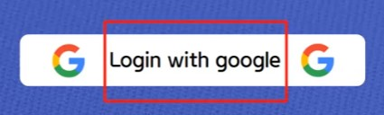
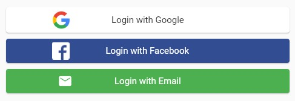

> <Youtube> [코딩셰프] 플러터(flutter) 강좌 조금 매운맛 01~07	(2020.03.19~2020.06.06)


*플러터(flutter) 강좌 조금 매운맛 01*

# Stateful widget part 1


## State

> UI가 변경되도록 영향을 미치는 데이터
>
> App 수준과 Widget 수준의 데이터 등 데이터의 범위가 넓음을 인지


### Stateless widget

> (코드 변경없이) State가 변하지 않는 위젯


### Statefull widget

> State 클래스가 결합 돼있음

Stateful widget의 Rebuilding 시기

- Child 위젯의 생성자를 통해서 데이터가 전달 될 때
- Internal state가 바뀔 때


## Widget - Element - Render Tree


> Widget - Element - Render 트리들의 구조 예시


> Element tree는 Hot reload시 rebuild대신 reload를 실행하게 해준다
> (모든 내용을 실행하는 것이 아닌 수정된 부분만 실행)


*플러터(flutter) 강좌 조금 매운맛 03~04*

# 로그인과 주사위 게임 플러터 앱 만들기


```dart
import 'dart:html';
import 'dart:math';

import 'package:flutter/material.dart';
import 'package:fluttertoast/fluttertoast.dart';

void main() => runApp(MyApp());

class MyApp extends StatelessWidget {
  @override
  Widget build(BuildContext context) {
    return MaterialApp(
      debugShowCheckedModeBanner: false,
      title: 'Dice game',
      home: LogIn(),
    );
  }
}

class LogIn extends StatefulWidget {
  @override
  State<LogIn> createState() => _LogInState();
}

class _LogInState extends State<LogIn> {
  TextEditingController? diceId = TextEditingController();
  TextEditingController? dicePwd = TextEditingController();

  @override
  Widget build(BuildContext context) {
    return Scaffold(
      appBar: AppBar(
        title: Text('Log in'),
        backgroundColor: Colors.green,
        centerTitle: true,
        leading: IconButton(icon: Icon(Icons.menu), onPressed: () {}),
        actions: <Widget>[
          IconButton(icon: Icon(Icons.search), onPressed: () {})
        ],
      ),
      body: GestureDetector(
        onTap: () {
          FocusScope.of(context).unfocus();
        },
        child: SingleChildScrollView(
          child: Column(
            children: [
              Padding(padding: EdgeInsets.only(top: 50.0)),
              Center(
                child: Image.asset(
                  'chef.gif',
                  width: 170.0,
                  height: 190.0,
                ),
              ),
              Form(
                  child: Theme(
                data: ThemeData(
                  primaryColor: Colors.teal,
                  inputDecorationTheme: InputDecorationTheme(
                      labelStyle:
                          TextStyle(color: Colors.teal, fontSize: 15.0)),
                ),
                child: Container(
                  padding:
                      EdgeInsets.symmetric(horizontal: 40.0, vertical: 0.0),
                  child: Column(
                    children: [
                      TextField(
                        autofocus: true,
                        controller: diceId,
                        decoration: InputDecoration(labelText: 'Enter "dice"'),
                        keyboardType: TextInputType.emailAddress,
                      ),
                      TextField(
                        controller: dicePwd,
                        decoration:
                            InputDecoration(labelText: 'Enter Password'),
                        keyboardType: TextInputType.text,
                        obscureText: true,
                      ),
                      SizedBox(
                        height: 30.0,
                      ),
                      ButtonTheme(
                        minWidth: 100.0,
                        height: 50.0,
                        child: ElevatedButton(
                          style: ElevatedButton.styleFrom(
                            primary: Colors.lime,
                          ),
                          child: Icon(
                            Icons.arrow_forward,
                            size: 40.0,
                          ),
                          onPressed: () {
                            if (diceId!.text == 'dice' &&
                                dicePwd!.text == '1234') {
                              Navigator.push(
                                  context,
                                  MaterialPageRoute(
                                      builder: (context) => DicePage()));
                            } else if (diceId!.text == 'dice') {
                              ScaffoldMessenger.of(context)
                                  .showSnackBar(SnackBar(
                                content: Text(
                                  'Check Password',
                                  textAlign: TextAlign.center,
                                ),
                                duration: Duration(seconds: 2),
                                backgroundColor: Colors.red[400],
                              ));
                            } else if (dicePwd!.text == '1234') {
                              ScaffoldMessenger.of(context)
                                  .showSnackBar(SnackBar(
                                content: Text(
                                  'Check "dice"',
                                  textAlign: TextAlign.center,
                                ),
                                duration: Duration(seconds: 2),
                                backgroundColor: Colors.red[400],
                              ));
                            } else {
                              ScaffoldMessenger.of(context)
                                  .showSnackBar(SnackBar(
                                content: Text(
                                  '정확한 값을 입력 해 주세요!',
                                  textAlign: TextAlign.center,
                                ),
                                duration: Duration(seconds: 2),
                                backgroundColor: Colors.red[400],
                              ));
                            }
                          },
                        ),
                      ),
                    ],
                  ),
                ),
              )),
            ],
          ),
        ),
      ),
    );
  }
}

class DicePage extends StatefulWidget {
  const DicePage({Key? key}) : super(key: key);

  @override
  State<DicePage> createState() => _DicePageState();
}

class _DicePageState extends State<DicePage> {
  int diceNum1 = Random().nextInt(6) + 1;
  int diceNum2 = Random().nextInt(6) + 1;

  @override
  Widget build(BuildContext context) {
    return MaterialApp(
      debugShowCheckedModeBanner: false,
      title: 'Dice Game',
      home: Scaffold(
        backgroundColor: Colors.lightGreen,
        body: Center(
          child: Column(
            mainAxisAlignment: MainAxisAlignment.center,
            children: [
              Padding(
                padding: const EdgeInsets.all(32.0),
                child: Row(
                  children: [
                    Expanded(
                      child: Image.asset(
                        'dice$diceNum1.png',
                        // height: 150.0,
                        // width: 150.0,
                      ),
                    ),
                    SizedBox(
                      width: 40.0,
                    ),
                    Expanded(
                      child: Image.asset(
                        'dice$diceNum2.png',
                        // height: 150.0,
                        // width: 150.0,
                      ),
                    )
                  ],
                ),
              ),
              SizedBox(
                height: 30.0,
              ),
              ElevatedButton(
                onPressed: () {
                  setState(() {
                    diceNum1 = Random().nextInt(6) + 1;
                    diceNum2 = Random().nextInt(6) + 1;
                  });
                  showToast(
                      "Left dice : {$diceNum1}, Right dice : {$diceNum2}");
                },
                child: Icon(
                  Icons.play_arrow,
                  size: 50.0,
                  color: Colors.white,
                ),
                style: ElevatedButton.styleFrom(
                  primary: Colors.amberAccent,
                ),
              ),
            ],
          ),
        ),
      ),
    );
  }
}

void showToast(String message) {
  Fluttertoast.showToast(
      msg: message,
      fontSize: 20.0,
      backgroundColor: Colors.grey,
      textColor: Colors.white,
      toastLength: Toast.LENGTH_SHORT,
      gravity: ToastGravity.BOTTOM);
}
```


*플러터(flutter) 강좌 조금 매운맛 06*

# Final과 const

> Final, const - 한번만 할당(초기화)할 수 있다. (재할당X)

Final

> Run-time Constance

- 앱이 실행될 때 초기화
- Stateless Widget과 비슷한 느낌으로 값을 수정하려면 Rebuilding이 필요함

const

> Compile-time Constance

- 선언과 동시에 초기화 필요 (Run-time 이전에 초기화)
- Rebuilding시 무시됨 => **성능향상**


*플러터(flutter) 강좌 조금 매운맛 07*

# Refactoring


## Opacity

> Opacity(불투명도)를 이용한 배치활용



- 뒤의 로고를 배치하고, `opacity: 0.0` 으로 투명하게 하여 글씨를 가운데 배치



```dart
SizedBox(
    height: 40.0,
    child: ButtonTheme(
        child: ElevatedButton(
            style: ElevatedButton.styleFrom(
                primary: Color(0xFF334D92),
            ),
            child: Row(
                mainAxisAlignment: MainAxisAlignment.spaceEvenly,
                children: <Widget>[
                    Image.asset('images/flogo.png'),
                    Text(
                        'Login with Facebook',
                        style: TextStyle(color: Colors.white, fontSize: 15.0),
                    ),
                    Opacity(
                        opacity: 0.0,
                        child: Image.asset('images/glogo.png'),
                    ),
                ],
            ),
            onPressed: () {},
        ),
        shape: RoundedRectangleBorder(
            borderRadius: BorderRadius.all(
                Radius.circular(4.0),
            ),
        ),
    ),
),
```


## Private

> `_`를 앞에 붙임
>
> 같은 파일 안에서만 사용가능

`_buildButton(),`


### main.dart

```dart
import 'package:flutter/material.dart';

import 'login_app/login.dart';

void main() {
  runApp(MyApp());
}

class MyApp extends StatelessWidget {
  @override
  Widget build(BuildContext context) {
    return MaterialApp(
      debugShowCheckedModeBanner: false,
      title: 'Firebase login app',
      home: LogIn(),
    );
  }
}
```


### login.dart

```dart
import 'package:firebaselogin/my_button/my_button.dart';
import 'package:flutter/material.dart';

class LogIn extends StatelessWidget {
  @override
  Widget build(BuildContext context) {
    return Scaffold(
      appBar: AppBar(
        backgroundColor: Colors.blue,
        title: Text(
          'Sign In',
          style: TextStyle(color: Colors.white),
        ),
        centerTitle: true,
        elevation: 0.2,
      ),
      body: _buildButton(),
    );
  }

  Widget _buildButton() {
    return Padding(
      padding: EdgeInsets.all(16.0),
      child: Column(
        mainAxisAlignment: MainAxisAlignment.center,
        children: <Widget>[
          MyButton(
            image: Image.asset('images/glogo.png'),
            text: Text(
              'Login with Google',
              style: TextStyle(color: Colors.black87, fontSize: 15.0),
            ),
            color: Colors.white,
            radius: 0.0,
            onPressed: () {},
          ),
          SizedBox(
            height: 10.0,
          ),
          MyButton(
            image: Image.asset('images/flogo.png'),
            text: Text(
              'Login with Facebook',
              style: TextStyle(
                color: Colors.white,
                fontSize: 15.0,
              ),
            ),
            color: Color(0xFF334D92),
            radius: 5.0,
            onPressed: () {},
          ),
          SizedBox(
            height: 10.0,
          ),
          MyButton(
            image: Icon(Icons.mail_outlined, size: 30.0,),
            text: Text(
              'Login with Email',
              style: TextStyle(
                color: Colors.white,
                fontSize: 15.0,
              ),
            ),
            color: Colors.green,
            radius: 20.0,
            onPressed: () {},
          )
        ],
      ),
    );
  }
}
```


### my_button.dart

```dart
import 'package:firebaselogin/login_app/login.dart';
import 'package:flutter/material.dart';

class MyButton extends StatelessWidget {
  MyButton({this.image, this.text, this.color, this.radius, this.onPressed});

  final Widget image;
  final Widget text;
  final Color color;
  final double radius;
  final VoidCallback onPressed;

  @override
  Widget build(BuildContext context) {
    return SizedBox(
      height: 40.0,
      child: ElevatedButton(
        child: Row(
          mainAxisAlignment: MainAxisAlignment.spaceBetween,
          children: <Widget>[
            image,
            text,
            Opacity(
              opacity: 0.0,
              child: image,
            ),
          ],
        ),
        style: ElevatedButton.styleFrom(
          primary: color,
          shape: RoundedRectangleBorder(
              borderRadius: BorderRadius.all(Radius.circular(radius))),
        ),
        onPressed: onPressed,
      ),
    );
  }
}
```


