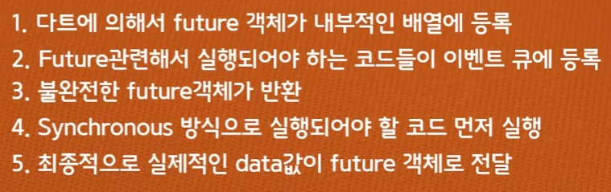
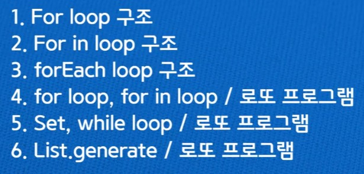
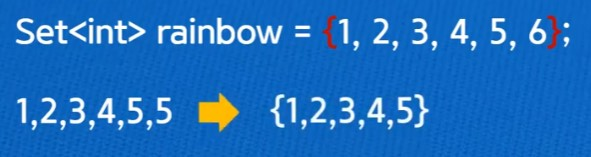
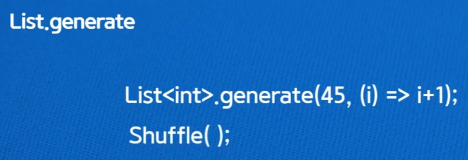

> <Youtube> [코딩셰프] 플러터(flutter) 강좌 조금 매운맛 08~11 (2020.06.18~2020.07.24)


*플러터(flutter) 강좌 조금 매운맛 08*

# Future, async, await


## Future

*Future의 이해*


*Future의 실행과정*




*Future와 async (간략)*


## async

Synchronous(동기) <=> Asynchronous(비동기)

- Synchronous (동기)
  - 요청과 응답이 연속적으로 발생해야 함 (**그 동안 다른 작업 불가**)
- Asynchronous (비동기)
  - 요청과 응답의 순서를 조절 할 수 있음 (효율적인 작업 가능)


## Async method

> async는 dart에게 **비동기라는 것을 알려주는 장치**
>
> async가 선언되면 **await과 함께 데이터가 올 것**임을 알고 기다린다
>
> > (await을 만나기 전까지 동기방식으로 진행된다)
>
> 따라서 async가 선언된 인스턴스의 return 타입은 Future이다.

*Future와 async의 관계*


*비동기 방식을 이용한 커피 주문 코드*

```dart
Future<String> createOrderMessage() async{
  print('주문받는 중');
  var order = await fetchUserOrder();
  return 'Your order is : $order';
}

Future<String> fetchUserOrder(){
  return Future.delayed(
    Duration(seconds: 2),
    () => 'Ice Americano',
  );
}

void main() async{
  print('어떤 커피 드시겠어요?');
  print(await createOrderMessage());
}
```

*`Future<void>` 타입사용 예시*

```dart
Future<void> createOrderMessage() async{
  print('주문받는 중');
  var order = await fetchUserOrder();
  print('Your order is : $order');
}

Future<String> fetchUserOrder(){
  return Future.delayed(
    Duration(seconds: 2),
    () => 'Ice Americano',
  );
}

void main() async{
  print('어떤 커피 드시겠어요?');
  await createOrderMessage();
}
```

결과

```
어떤 커피 드시겠어요?
주문받는 중
Your order is : Ice Americano
```


### Thread

> Program + (명령) => Process (실행)
>
> **Thread는 Process내에서 실질적인 동작을 담당**


Dart는 싱글 스레드로 운영되는 언어 - 동시에 한 가지 작업밖에 못 함


### Event loop

> Future나 Stream도 Event loop에서 처리된다

1. First In First Out(FIFO) 방식으로 "MicroTack와 Event" 준비
2. main 함수 실행
3. Event loop 실행


*Sync(동기) 코드들을 처리한 이후 Async 코드를 Event que의 순서대로 처리*

```dart
void main() {
  print('1');
  Future((){
    print('3');
  }).then((_){
    print('4');
  });
  print('2');
}
```


*플러터(flutter) 강좌 조금 매운맛 10*

# 반복문(loop)

> +반복문을 이용한 로또 프로그램 만들기


강의 목표




## For loop

```dart
void main(){
  List<String> rainbow = ['빨','주','노','초','파','남','보'];
  
  for(int i = 0; i<rainbow.length; i++){
    print(rainbow[i]);
  }
}
```


## For in loop

> 리스트에서 loop구성 용이

```dart
void main(){
  List<String> rainbow = ['빨','주','노','초','파','남','보'];
  
  for(String x in rainbow){
    print(x);
  }
}
```


## forEach loop

> For in loop와 기능은 같지만 성능이 더 좋다

```dart
void main(){
  List<String> rainbow = ['빨','주','노','초','파','남','보'];
  
  rainbow.forEach((x){
    print(x);
  });
}
```


# Set

> List와 다르게 Set은 중복X

- List - []

- Set - {}




## 로또 번호 생성

> Set으로 중복제거

```dart
import 'dart:math';

Set<int> lottoNumber(){
  
  final Set<int> lottoSet = {};
  
  while(lottoSet.length != 6){
    lottoSet.add(Random().nextInt(45) + 1);
  }
  
  return lottoSet;
}

void main(){
  print(lottoNumber());
}
```


## List.generate

> 더미 데이터 생성




*List.generate와 shuffle로 쉽게 로또 번호 생성*

```dart
void main(){
  var test = List<int>.generate(45, (i) => i+1);
  var test2 = test..shuffle();
  var subl = test2.sublist(0,6);
  print(subl);
}
```

> List를 shuffle하려면 `..`(cascade Notation)으로 접근해야 함
>
> sublist(`first index`, `(last index)+1`)로 구성

- `(i) => i+1` 은 **전위연산자** `(i) => ++i`와 같은 결과
- **후위연산자** `(i) => i++`를 사용하면 로또 번호는 0~44가 된다


## Cascade Notation

> 객체의 멤버함수나 속성에 접근 가능
