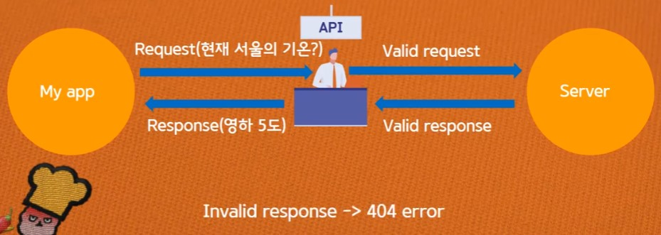
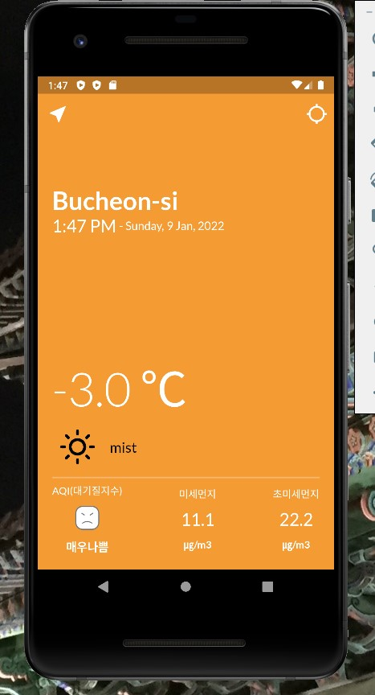

> <Youtube> [코딩셰프] 플러터(flutter) 강좌 조금 매운맛 13~1 (2021.01.29~2021.0.)


*플러터(flutter) 강좌 조금 매운맛 13~17*

# 날씨 앱(weather app) 만들기


강의 목차

1. Widget lifecycle
2. API
3. Exception handling
4. Http package
5. Jason parsing
6. Passing data


## 생명주기 (Widget lifecycle)

Stateful Widget이 Stateless Widget보다 라이프사이클이 더 길다.
(Stateless Widget은 build - destroy - rebuild 정도밖에 없다.)


- initState method - 초기화
- build method - 생성
- dispose method / deactivate method - 파기


## API

1. 일련의 표준화된 명령어나 기능

2. 매개 역할자로써의 API - key필요

   > 


*위치 정보 - geolocator API 사용*

```yaml
dependencies:
  geolocator: ^8.0.1
```


*날씨 정보 - OpenWeather API 사용*

> [Weather API - OpenWeatherMap](https://openweathermap.org/api)


## Exception Handling

> `try ~ catch` 사용


## Http package

>[http | Dart Package (pub.dev)](https://pub.dev/packages/http)


## JSON parsing


### JSON VS XML

- JSON - JavaScript Object Notation
  - key와 value 데이터를 map으로 묶음

- XML - eXtensible Markup Language
  - HTML과 상당히 유사하지만
    - HTML은 `<p></p>`와 같이 약속된 태그만 이용할 수 있지만
    - XML은 임의로 태그를 만들 수 있다.


*OpenWeather API response 예시 (JSON)*

> https://samples.openweathermap.org/data/2.5/weather?q=London&appid=b1b15e88fa797225412429c1c50c122a1#

```json
{
    "coord": {
        "lon": -0.13,
        "lat": 51.51
    },
    "weather": [
        {
            "id": 300,
            "main": "Drizzle",
            "description": "light intensity drizzle",
            "icon": "09d"
        }
    ],
    "base": "stations",
    "main": {
        "temp": 280.32,
        "pressure": 1012,
        "humidity": 81,
        "temp_min": 279.15,
        "temp_max": 281.15
    },
    "visibility": 10000,
    "wind": {
        "speed": 4.1,
        "deg": 80
    },
    "clouds": {
    	"all": 90
    },
    "dt": 1485789600,
    "sys": {
        "type": 1,
        "id": 5091,
        "message": 0.0103,
        "country": "GB",
        "sunrise": 1485762037,
        "sunset": 1485794875
    },
    "id": 2643743,
    "name": "London",
    "cod": 200
}
```

*OpenWeather API response 예시 (xml)*

> https://samples.openweathermap.org/data/2.5/weather?q=London&appid=b1b15e88fa797225412429c1c50c122a1#

```xml
<current>
	<city id="2643743" name="London">
		<coord lon="-0.13" lat="51.51"/>
		<country>GB</country>
		<sun rise="2017-01-30T07:40:36" set="2017-01-30T16:47:56"/>
	</city>
	<temperature value="280.15" min="278.15" max="281.15" unit="kelvin"/>
	<humidity value="81" unit="%"/>
	<pressure value="1012" unit="hPa"/>
	<wind>
		<speed value="4.6" name="Gentle Breeze"/>
		<gusts/>
		<direction value="90" code="E" name="East"/>
	</wind>
	<clouds value="90" name="overcast clouds"/>
	<visibility value="10000"/>
	<precipitation mode="no"/>
	<weather number="701" value="mist" icon="50d"/>
	<lastupdate value="2017-01-30T15:50:00"/>
</current>
```


# 더미날씨데이터를 이용한 로딩화면 (연습)

> 'loading.dart'파일


```dart
import 'package:flutter/material.dart';
import 'package:geolocator/geolocator.dart';
import 'package:http/http.dart' as http;
import 'dart:convert' as convert;
//import에 as를 사용하여 패키지명을 대체할 단어를 선언할 수 있다.

class Loading extends StatefulWidget {
  const Loading({Key? key}) : super(key: key);

  @override
  _LoadingState createState() => _LoadingState();
}

class _LoadingState extends State<Loading> {
  @override
  void initState() {
    // TODO: implement initState
    super.initState();
    getLocation();
    fetchData();
  }

  void fetchData() async{
    Uri uri = Uri.parse('https://samples.openweathermap.org/data/2.5/weather?q=London&appid=b1b15e88fa797225412429c1c50c122a1');
    http.Response response = await http.get(uri);
    //import에 as http를 붙여주지 않으면,
    //Response response = await get(uri);
    //Response와 get의 출처를 알기 어렵다.
    if(response.statusCode == 200){
      String jsonData = response.body;
      var myJsonWD = convert.jsonDecode(jsonData)['weather'][0]['description'];
      var myJsonWind = convert.jsonDecode(jsonData)['wind']['speed'].toString();
      var myJsonId = convert.jsonDecode(jsonData)['id'].toString();
      print('날씨상세정보 : '+myJsonWD);
      print('바람세기 : '+myJsonWind);
      print('아이디 : '+myJsonId);
    }
  }

  void getLocation() async {
    try {
      Position position = await Geolocator.getCurrentPosition(
          desiredAccuracy: LocationAccuracy.high);
      print(position);
    } catch (e) {
      print('에러가 발생했습니다');
    }
  }

  @override
  Widget build(BuildContext context) {
    return Scaffold(
      body: Center(
        child: ElevatedButton(
          child: Text('Get my loaction'),
          onPressed: () {
            // getLocation();
          },
        ),
      ),
    );
  }
}
```

- `import as ~` - 편의성을 위해 사용 (시각적 구분)
- `jsonDecode`를 사용하여 JSON데이터 분석


## Passing data

> Refactoring - 기존의 UI나 프로그램의 기능을 변경하지 않고 내부적인 코드를 수정하는 것


Refactoring시 기능과 역할에 따라 분류한 코드를, 새로운 dart파일로 코드를 옮긴다.
이때 data를 주고 받는 방법은 argument와 parameter를 활용하면 된다.


*플러터(flutter) 강좌 조금 매운맛 16*

## weather app_16

```yaml
#추가한 api들
dependencies:
  geolocator: ^8.0.1
  #실제 위치(위도+경도)를 알려주는 api
  http: ^0.13.4
  #uri를 이용하여 온라인 데이터 연동
  google_fonts: ^2.2.0
  flutter_svg: ^1.0.0
  timer_builder: ^2.0.0
  #시스템 시간 사용가능
  intl: ^0.17.0
  #(DateTime은 dart:core에서 기본제공) 날짜 포멧 설정 - Dateformat
```


*앱 화면*


