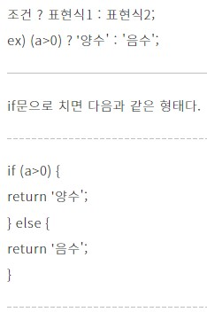
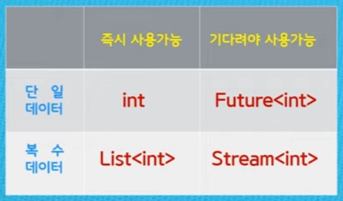

> <Youtube> [코딩셰프] 플러터(flutter) 강좌 조금 매운맛 20~ (2021.09.04~2021.07.06)


*플러터(flutter) 강좌 조금 매운맛 20~21*

# 채팅 앱(chatting app) UI 디자인

> 


학습목표


## Stack

> children에 나열한 여러 위젯을 순서대로 겹치게 함


### Positioned

> Stack내에서 위치설정


## MediaQuery

> 스마트폰의 크기와 사양에 맞춰 화면 조절

```dart
Positioned(
            top: 180,
            child: Container(
              height: 280,
              width: MediaQuery.of(context).size.width-40,
              margin: EdgeInsets.symmetric(horizontal: 20.0),
              decoration: BoxDecoration(
                color: Colors.white,
                borderRadius: BorderRadius.circular(15.0),
                boxShadow: [
                  BoxShadow(
                    color: Colors.black54.withOpacity(0.3),
                    blurRadius: 15,
                    spreadRadius: 5
                  )
                ]
              ),
            ),
          ),
```


## Rich Text

> 서로 다른 디자인의 텍스트를 나열 할 수 있음


## TextFormField

> TextField는 TextEditingController의 변수가 필요해서 입력받을 TextField가 많아지면 관리하기 어려움
>
> TextFormField는 Form의 children으로 묶어 관리할 수 있음


### Validator

> TextFormField의 값의 유효성을 확인 할 수 있고, 경고 메시지를 보여주는 기능도 있음


### Form의 `GlobalKey<FormState>()`

> Form내의 TextFormField의 State를 관리 할 수 있음
>
> `currentState`의 멤버변수인 `validator, onSave, onChanged`를 설정한다


```dart
  final _formKey = GlobalKey<FormState>();  
  void _tryValidation() {
    final isValid = _formKey.currentState!.validate();
  //validator의 return이 모두 null이면 true
    if (isValid) {
      _formKey.currentState!.save();
    }
  }


TextFormField(
    key: const ValueKey(1),
    validator: (value) {
        if (value!.isEmpty || value.length < 4) {
            return 'Please enter at least 4 characters';
            }
        return null;
        },
    onSaved: (value) {
        userName = value!;
        },
  // _formKey.currentState!.save() 실행시 저장할 데이터
    onChanged: (value) {
        userName = value;
        },
    ),
```


# 삼항연산자

> [06화 다트 연산자 (Dart Operator) (brunch.co.kr)](https://brunch.co.kr/@mystoryg/120)





# Firebase

> 참고 : [Form 으로 손쉽게 여러개의 텍스트필드 상태관리하기! | 코드팩토리 블로그 (codefactory.ai)](https://blog.codefactory.ai/flutter/form/)
>
> flutter에서 firebase를 사용하기 위해선 `Firebase.initializeApp()`메서드를 호출필요
>
> Firebase.initializeApp은 비동기 방식으로 실행되기에 다른 방식으로 initialize해야함


*main함수에 `WidgetsFlutterBinding.ensureInitialized()` 추가*

```dart
import 'package:firebase_core/firebase_core.dart';

void main() {
  WidgetsFlutterBinding.ensureInitialized();
  runApp(const MyApp());
}
```


# Stream의 개념

> .




## Xml to Json

>[[Flutter\] Xml 을 Json으로 바꾸.. : 네이버블로그 (naver.com)](https://blog.naver.com/nam_0510/222122129597)


## UTF-8 encoding

> [[FlUtTeR\] http 패키지 - 리턴 값의 한글이 깨질때 (tistory.com)](https://freecatz.tistory.com/130)
>
> decode의 argument는 `List<int>`이므로 `response.body`가 아닌 `response.bodyBytes `사용
